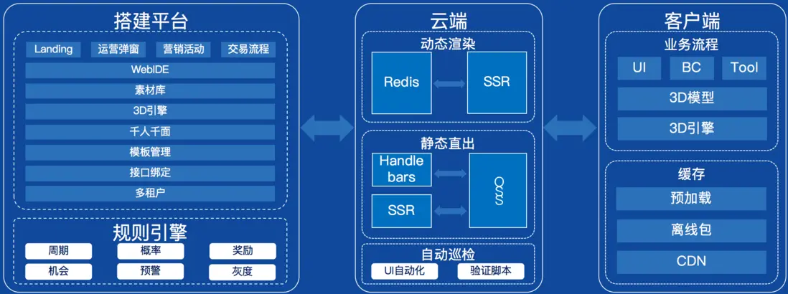

# 设计文档

## 产品特性

信也神笔低代码设计平台是基于最前沿的拉新、促活、成交等业务而打造的一站式低代码无代码平台。通过极速投放、渠道归因、大盘分析、策略调整来降低获客成本、提高成交量，助力企业实现营销收益最大化。

### 主要特点

1. **可视化搭建**：提供丰富的组件和页面模版，用户通过简单拖拽、配置即可实现页面快速搭建。
2. **灵活调整**：轻松调整页面布局、内容和样式，无需编写大量代码。
3. **支持A/B测试**：一次投放多个版本，即时观察各版本转化，快速调整利益点。
4. **自定义和扩展能力**：通常提供了丰富的扩展插件和API接口，方便开发者根据自身需求进行功能扩展和定制化开发。

### 应用场景

1. **营销活动页面搭建**，用于搭建营销活动的参与页面，支持做任务、参与抽奖、裂变拉新等玩法。
2. **落地页搭建**：用于各渠道引流，引导用户点击进入业务页面，达到引流转化的效果。
3. **A/B测试营销策略**：通过对比两个或多个不同版本的活动页面，实现精准营销、提高转化率。

## 技术方案

神笔低代码设计平台从架构上主要分为“搭建平台、云端、客户端”三部分，整体是通过云端一体化的方案来实现的，达成了复杂业务、极致性能、高效交付三者的有效统一。

## 竞品对比

目前市场上已经有不少较成熟的低代码开发平台，像钉钉宜搭、腾讯云微搭等。

### 钉钉宜搭

#### 优点

- 低成本、快速交付，宜搭采用按需付费的方式，降低了企业的资金投入成本。同时，由于其低代码开发的特性，可以快速构建应用程序，缩短了开发周期。
- 可视化界面设计，应用软件增添了可视化的界面设计工具，用户可通过拖拽组件和配置参数迅速构建应用软件页面，减少了技术门槛。

#### 缺点

- 对新手不够友好，虽然宜搭提供了可视化的界面设计工具，但对于新手来说，可能还需要一定的学习成本才能快速上手。
- 集成能力有限，宜搭在与其他系统的集成方面可能存在一定的限制，对于高度复杂的场景可能需要结合其他工具或服务来实现。

### 腾讯云微搭

#### 优点

- 强大的开发能力，微搭提供了可视化的界面设计和丰富的组件资源，同时结合腾讯云的技术能力，可以实现高性能、高并发的应用搭建。
- 多场景化应用模板，微搭提供了多种应用模板，可以满足多种场景的需求，如小程序、H5、Web应用等。

#### 缺点

- 技术门槛较高，对于一些高度定制化的需求，微搭仍需要开发者具备一定的编程能力。
- 安全保障机制有待完善，虽然微搭提供了一些安全保障机制，但在数据安全和隐私保护等方面仍有待完善。

### 信也神笔低代码设计平台

#### 优点

- 操作简便、易于使用，神笔活动平台提供了可视化编辑界面，产品或运营人员通过简单的拖拽配置，即可完成活动页面的快速创建。
- 功能丰富、开箱即用，神笔活动平台拥有九宫格、大转盘、扭蛋机、放飞孔明灯、营销弹窗等二十余种活动的自助设计与投放。
- 千人千面、精细化运营，神笔活动平台支持项目多版本管理，方便 A/B 测试，帮助企业优化营销内容和策略。

## 版本计划

### v1.0.0 

Features

- 新产品首次发布
