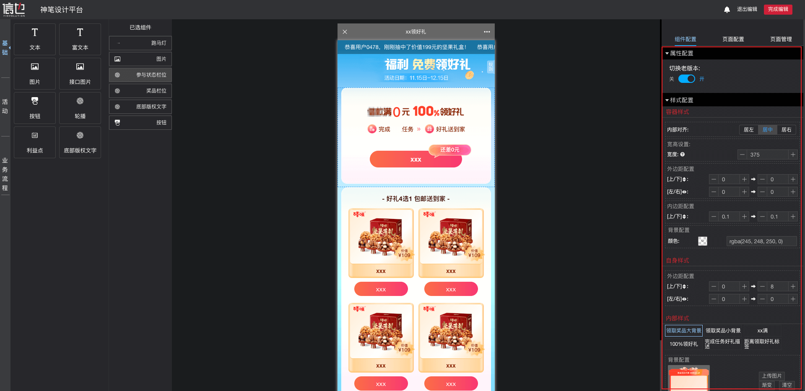
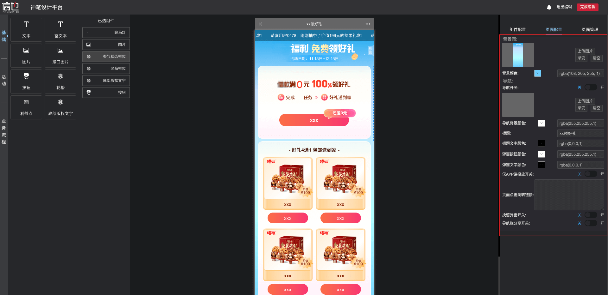

# 用户手册

## 1. 创建项目

**路径**：搭建平台首页 >> 新建项目 >> 保存

## 2. 在项目中添加版本

### 2.1 在新建项目过程中，添加版本

**路径**：搭建平台首页 >> 新建项目 >> 添加版本

### 2.2 在项目列表中，添加版本

**路径**：搭建平台首页 >> 未上线项目 >> 项目列表操作，添加版本

## 3. 版本编辑

**路径**：搭建平台首页 >> 项目列表 >> 模版编辑 >> 开始编辑

### 3.1 添加组件

**路径**：组件面板 >> 点击需要的组件 >> 组件出现在已选组件面板

### 3.2 组件配置

**路径**：已选组件 >> 点击需要配置的组件  >> 组件配置（属性配置、样式配置）

### 3.3 页面配置

**路径**：页面配置

### 3.4 版本编辑取消/保存

**路径**：取消编辑/完成编辑

## 4. 页面查看

**路径**：搭建平台首页 >> 项目列表 >> 项目列表操作，打开链接

